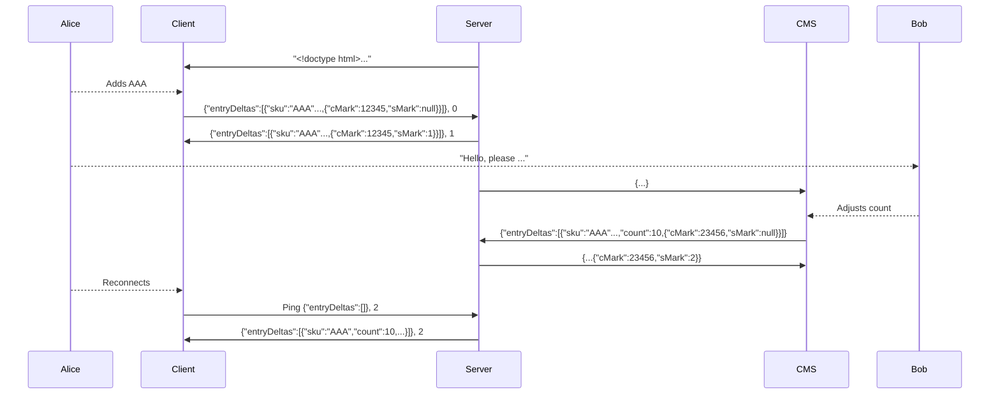

```mermaid
sequenceDiagram
  participant User as Alice
  participant Client
  participant Server
  participant CMS
  participant CustomerRep as Bob
  Server->>Client: "<!doctype html>..."
  User-->>Client: Adds AAA
  Client->>Server: {"entryDeltas":[{"sku":"AAA"...,{"cMark":12345,"sMark":null}}]}, 0
  Server->>Client: {"entryDeltas":[{"sku":"AAA"...,{"cMark":12345,"sMark":1}}]}, 1
  User-->>CustomerRep: "Hello, please ..."
  Server->>CMS: {...}
  CustomerRep-->>CMS: Adjusts count
  CMS->>Server: {"entryDeltas":[{"sku":"AAA"...,"count":10,{"cMark":23456,"sMark":null}}]}
  Server->>CMS: {...{"cMark":23456,"sMark":2}}
  User-->>Client: Reconnects
  Client->>Server: Ping {"entryDeltas":[]}, 2
  Server->>Client: {"entryDeltas":[{"sku":"AAA","count":10,...}]}, 2
```
